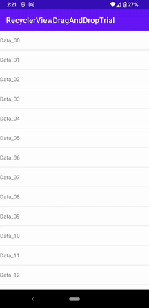

# RecyclerViewDragAndDropTrial
RecyclerViewを用いて、リスト表示している項目の「ドラッグ＆ドロップ移動」「スワイプ削除」を実現する方法。

EmptyActivityのプロジェクトを作成し、手を加えたファイルは以下。
- ItemListAdapterクラスファイルの追加
- MainActivityクラスを編集
- activity_mainレイアウトファイルの編集
- listitem_itemレイアウトファイルの追加
- ic_baseline_delete_32ドローワブルファイルの追加
 
要点としては、以下。
- activity_mainレイアウトに、RecyclerViewを設置する
- listitem_itemレイアウトに、リスト表示の１項目のレイアウトを実装する。
- ItemListAdapterクラスは、RecyclerView.Adapterクラスの派生クラスとし、リサイクラービューの作成やバインド等の処理を実装する。
- RecyclerViewを保持するMainActivityクラスでは、アダプターの作成と登録、タッチヘルパーの作成と登録等の処理を実装する。
- ドラッグ＆ドロップ移動機能は、RecyclerViewを保持するMainActivityクラスのタッチヘルパーの作成の onMove() の実装によって実現される。
- スワイプ削除機能は、RecyclerViewを保持するMainActivityクラスのタッチヘルパーの作成の onSwiped() の実装によって実現される。
- スワイプ削除機能のスワイプ時の項目の背景描画は、RecyclerViewを保持するMainActivityクラスのタッチヘルパーの作成の onChildDraw() の実装によって実現される。
- スワイプ削除機能のスワイプ時の項目の背景描画の際に表示するゴミ箱アイコンは、Vector Asset Studioを利用して作成する。

## Screenshots : スクリーンショット


## Requirements : 必要条件、依存関係
- Android Studio 4.2.2

## Author : 作者
Nobuki HIRAMINE : [http://www.hiramine.com](http://www.hiramine.com)

## License : ライセンス
```
Copyright 2021 Nobuki HIRAMINE

Licensed under the Apache License, Version 2.0 (the "License");
you may not use this file except in compliance with the License.
You may obtain a copy of the License at

    http://www.apache.org/licenses/LICENSE-2.0

Unless required by applicable law or agreed to in writing, software
distributed under the License is distributed on an "AS IS" BASIS,
WITHOUT WARRANTIES OR CONDITIONS OF ANY KIND, either express or implied.
See the License for the specific language governing permissions and
limitations under the License.
```

